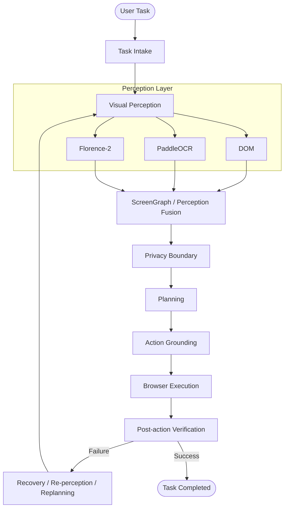
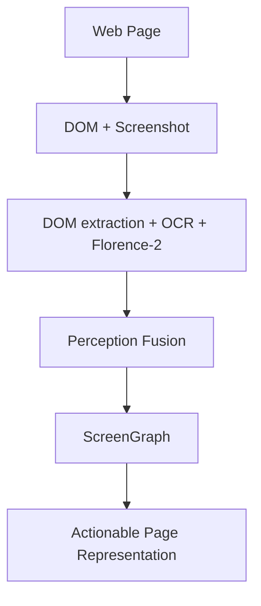

# KAMNAA

KAMNAA is a privacy-oriented, perception-driven browser agent that executes complex web tasks directly on-device without exposing sensitive user data. 

## What KAMNAA Is

KAMNAA is an advanced browser automation agent that operates as a Chrome extension. It understands the web by fusing traditional DOM analysis with visual perception, allowing it to navigate, interpret, and automate interfaces like a human user. 

Unlike conventional automation scripts that rely on rigid element selectors, KAMNAA perceives the page dynamically. It reads the structural DOM alongside visual signals—including text locked in images or canvases—to build a unified understanding of the screen.

Operating entirely on-device by default, KAMNAA emphasizes privacy and security. It detects personally identifiable information (PII) locally, redacts it from visual captures, and is designed to prevent sensitive data from leaving the local environment.

## Why KAMNAA

Browser automation typically falls into two fragile extremes: relying entirely on the DOM or relying entirely on pixel screenshots.

DOM-only agents break when websites use complex single-page apps, canvas elements, or hidden shadows that obscure the visual reality of the page. Conversely, vision-only agents struggle to accurately click targets, lack semantic understanding of form boundaries, and often hallucinate interactions. Furthermore, remote-reasoning agents that transmit raw screenshots inherently leak sensitive user data to cloud providers.

KAMNAA addresses these engineering problems by introducing a multi-modal perception layer that combines DOM structure with visual context. It processes data through a strict local privacy boundary, sanitizing the context before reasoning to prevent PII leaks. Actions are grounded locally and verified post-execution, preventing blind, hallucinated workflows.

## System Architecture

KAMNAA operates through a structured pipeline that ensures safe, verified, and grounded interactions.



### 1. Perception
Gathers signals from the DOM structure, text via OCR, and visual semantics via the Florence-2 model.

### 2. Representation
Merges these signals into a deduplicated `ScreenGraph` that represents the true visual and interactive state of the page.

### 3. Planning
Evaluates the task against the sanitized screen representation using either a local deterministic planner or an LLM to generate an actionable sequence of steps.

### 4. Grounding
Matches the planner's abstract targets to concrete interactive elements on the page, resolving ambiguities through fuzzy matching.

### 5. Execution
Dispatches human-like interactions (clicks, keyboard sequences, event bubbling) directly in the browser tab.

### 6. Verification
Validates that the executed actions successfully altered the page state as intended.

### 7. Recovery
Re-perceives the page and replans (up to a bounded limit) if an action fails or causes an unexpected navigation.

### 8. Privacy Boundary
Designed to prevent raw PII from escaping the local environment, sanitizing all contexts before they reach any reasoning engine.

## Perception Engine

KAMNAA’s perception engine is built on a tri-signal approach, solving the limitations of DOM-only scraping. It is the core technical contribution of the agent.



1. **DOM Perception**: Extracts native page structure, form semantics, roles, labels, and boundaries using native browser APIs.
2. **OCR Engine**: Runs PaddleOCR ONNX models (detection and recognition) locally via ONNX Runtime Web. It discovers text rendered in images or canvases that the DOM hides.
3. **Florence-2 Engine**: A local Vision Transformer (ViT) running via Transformers.js that performs open-vocabulary object detection and visual grounding, catching UI elements that lack semantic markup.

These three signals are merged by the **ScreenGraph Fusion** algorithm. Overlapping elements are deduplicated using Intersection over Union (IoU) metrics, resulting in a single, high-confidence map of the screen.

## From Perception to Action

Seeing an element is not the same as clicking it. KAMNAA bridges the gap between perception and action through its grounding layer.

When the planner dictates an action (e.g., `{"type": "click", "target": "Submit"}`), the agent resolves this intent against the actual page. It performs:
- **Semantic Matching**: Resolving labels to element indices or CSS selectors.
- **Target Validation**: Ensuring the target is visible, enabled, and interactive.
- **Fuzzy Fallbacks**: Using Levenshtein distance to find targets if the exact text mutated slightly.
- **Coordinate Grounding**: Executing coordinate-based interactions if the target only exists in the visual/OCR layer and has no corresponding DOM node.

## Agent Execution Pipeline

The execution pipeline consists of strictly ordered engineering stages:

1. **Task Intake**: Receives the user goal and decomposes it into sub-tasks.
2. **Page Perception**: Captures the DOM and takes a screenshot for visual analysis.
3. **Context Construction**: Fuses DOM, OCR, and ViT data into a unified representation.
4. **Target Sanitization**: Detects and redacts PII from both the DOM context and the screenshot.
5. **Planning**: Decides the sequence of actions. For form-fills, a fast deterministic planner runs locally. For complex reasoning, it queries an LLM.
6. **Target Grounding**: Matches abstract planned steps to precise interactive targets.
7. **Execution**: Dispatches the action via content scripts with human-like delays.
8. **Verification**: Checks if the action succeeded or if the DOM changed unexpectedly.
9. **Recovery**: Bounded loop to recover from stale targets or unexpected navigations.

## Privacy Architecture

KAMNAA is designed to maintain privacy through a robust on-device sanitization pipeline before any data is processed for reasoning.

- **PII Detection**: Runs 15+ regex patterns for sensitive Indian PII (Aadhaar, PAN, Phone, IFSC, etc.) against DOM text, and uses FaceDetector APIs and visual heuristics to find faces and password fields on the canvas.
- **PII Redaction**: Modifies the captured screenshot using an `OffscreenCanvas` to apply Gaussian blur to faces, black boxes to passwords/IDs, and pixelation to moderate-sensitivity data. It also injects CSS into the live page to visually indicate protected fields to the user.
- **Sanitized Context**: The structured representation sent to the planner strips out all PII values, replacing them with generic markers (e.g., `[PII:name]`).
- **Redaction Verification**: The system re-runs OCR on the *redacted* screenshot frame to verify the redacted output before any network egress occurs.
- **Outbound Protection**: The extension monitors its own outbound network requests to generate a privacy proof, verifying what data left the device.

## Models and Runtime

KAMNAA uses a hybrid local/cloud architecture depending on the task complexity and available hardware.

| Model | Role | Runtime | Used By |
|-------|------|---------|---------|
| **PaddleOCR (ONNX)** | Text detection and recognition (English/Hindi) | ONNX Runtime Web (WASM/WebGPU) | Visual Perception |
| **Florence-2-base-ft** | Visual grounding and object detection | Transformers.js (WebGPU) | Visual Perception |
| **qwen2.5:1.5b** | Default LLM action planner | Local via Ollama | Action Planning |
| **Claude-3-5-haiku** | Fallback LLM planner | Anthropic API | Action Planning |
| **gpt-4o-mini** | Fallback LLM planner | OpenAI API | Action Planning |
| **llama-3.2-1b** | Fallback LLM planner | OpenRouter API | Action Planning |

*Note: All ML models for perception (OCR, Florence-2) run strictly locally in the background service worker/offscreen document.*

## Planning and Reasoning

KAMNAA does not immediately reach for an LLM. 

For standard interactions (like filling an address form), KAMNAA uses a **deterministic planner**. This engine operates locally in under 100ms, mapping form fields to known data contexts without hallucination risks or network overhead.

When tasks require complex reasoning, the system delegates to an LLM provider. The agent sends a sanitized, structured `ScreenGraph` (containing no PII values). The LLM returns a structured JSON sequence of actions, which is validated against strict execution bounds (maximum 25 steps for standard tasks, 10 for recovery) to prevent runaway hallucination loops.

## Reliability and Verification

KAMNAA treats "action dispatched" as distinct from "task succeeded".

Before executing an action, the agent validates the target's interactive state. After execution, the agent observes the page. If an element becomes stale, a navigation event interrupts the flow, or an action fails to produce the expected state, KAMNAA triggers a bounded recovery loop. It re-perceives the fresh page state and replans the remaining steps. 

To prevent infinite loops, recovery is strictly bounded to a maximum of 1 replan.

## Project Layout

```text
kamnaa/
├── src/
│   ├── core/
│   │   ├── actions/        # Event bubbling, clicking, typing
│   │   ├── agent/          # Planners, LLM providers, task decomposer
│   │   ├── extraction/     # Fast DOM readers
│   │   ├── memory/         # IndexedDB encrypted storage
│   │   ├── ocr/            # PaddleOCR integration
│   │   ├── perception/     # DOM extractor, Florence-2, ScreenGraph fusion
│   │   ├── pipeline/       # Full execution loop
│   │   ├── privacy/        # PII regex, canvas redaction, overlays
│   │   ├── runtime/        # ML model hosting
│   │   └── verification/   # Post-action checks
│   ├── entrypoints/        # Extension background, content scripts, sidepanel
│   ├── ui/                 # React components for the interface
│   └── types/              # TypeScript definitions
├── tests/                  # Vitest test suites
├── scripts/                # Build and model download utilities
├── wxt.config.ts           # Extension bundler configuration
└── package.json            # Dependencies and commands
```

## Getting Started

### Prerequisites
- Node.js (v20+)
- `pnpm` or `npm`
- (Optional) Ollama running locally for `qwen2.5:1.5b`

### Installation

1. Install dependencies:
   ```bash
   npm install
   ```

2. Download local ML models (required for OCR and Florence-2):
   ```bash
   npm run models
   ```

3. Run the development build:
   ```bash
   npm run dev
   ```

4. **Load the Extension:**
   - Open Chrome and navigate to `chrome://extensions/`
   - Enable "Developer mode"
   - Click "Load unpacked"
   - Select the generated `.output/chrome-mv3` directory.

### Production Build
To create a finalized build:
```bash
npm run build
```

## Testing

The project uses Vitest for testing agent behavior, PII detection logic, and grounding mechanisms.

Run the test suite:
```bash
npm run test
```

## Current Capabilities

### Implemented
- Unified DOM + OCR + ViT perception.
- Strict on-device PII detection (15+ Indian data formats).
- Visual canvas redaction (blurring, pixelation, masking).
- Verifiable redaction proofs (re-OCR).
- Local planning via deterministic mapping.
- Local LLM planning (Qwen 2.5 via Ollama).
- Abstract-to-concrete action grounding.
- Bounded recovery and replanning.

### In Development / Planned
- Multi-tab workflow engine (carrying state across different pages).
- Deterministic task replay (recording workflows for 0-inference execution).
- Voice command integration (Web Speech API).
- Self-improving agent memory for higher reliability on known sites.

## Research Context

KAMNAA was developed with considerations for the SIH 2026 Problem Statement 26171: *On-device Visual Perception for Lightweight Browser Agents*. Its architecture prioritizes strict data privacy, offline capabilities, and highly accurate multi-modal page perception.
